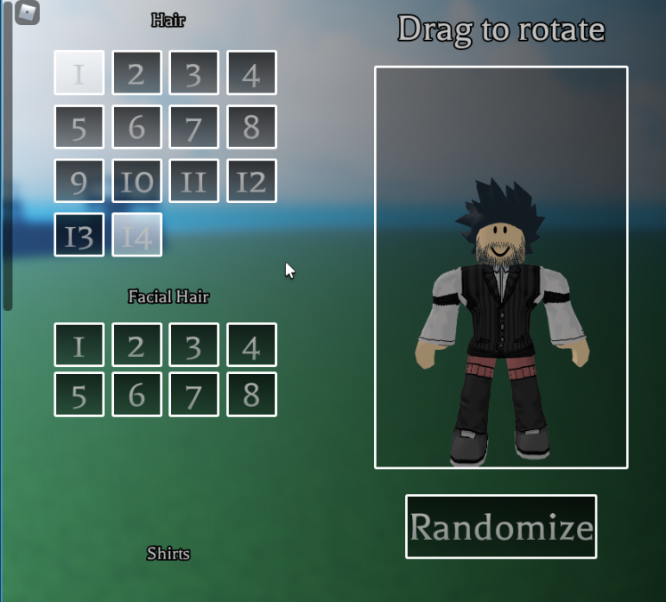

# RoMouseEvents
ROBLOX Module that provides an abstraction for alternative `gui.MouseEnter` &amp; `gui.MouseLeave` events. 

# Why?

The stock `gui.MouseEnter` and `gui.MouseLeave` events provided by roblox operate in undesirable ways for many.

One example of this might be where two seperate GUI fire `.MouseEnter` without `.MouseLeave` firing for the other,
Causing possibly unintended behavior:



Notice that two of the buttons are highlighted at once. This is visually jarring in this case.

# Getting started

## Installation

### Method 1 (Recommended):

1. 
```bash
git clone "https://github.com/CozzyBro2/RoMouseEvents"
```
2. Copy the `src` directory into your project directory with your file explorer. Or perform a merge by other means
3. Initialize the rojo server

### Method 2:

1. Go to the [src/shared](/src/shared/) directory
2. Download a copy of `MouseEvents.lua`
3. Drag it into roblox

## Configuration

Many options in the module can be configured.

Configuration is done both through the `global_config` table in the module,
and through a configuration table passed as the second argument of `module.Listen`.

This table inherits and overwrites any values from `global_config` to keep usage simple,
meaning any changes made to the `global_config` will reflect to any future calls to `module.Listen`.

### Options:

* `allowMultiple: bool`

	Whether the event can fire on a gui while another gui is currently entered.

	* Recommended: `false`
	* Default: `false`

### Other config

* You can use the `MakeSignal` wrapper function to change the signal you use.
	* You can use any signal creator, i.e `BindableEvents`, or something like `GoodSignal` for example.
		NOTE: Any custom signal must use the same construction and firing syntax as bindable events.

* `events_enabled` constant.
	* Set to 'false' to disable all custom behavior
		and fallback to the default roblox events.

	* A case where this may be useful would be if roblox ever improves
		the stock events; which would render this module obsolete.


# API

* `module.Listen(gui: GuiObject, info: dictionary)`
* `module.Release(gui: GuiObject)`

